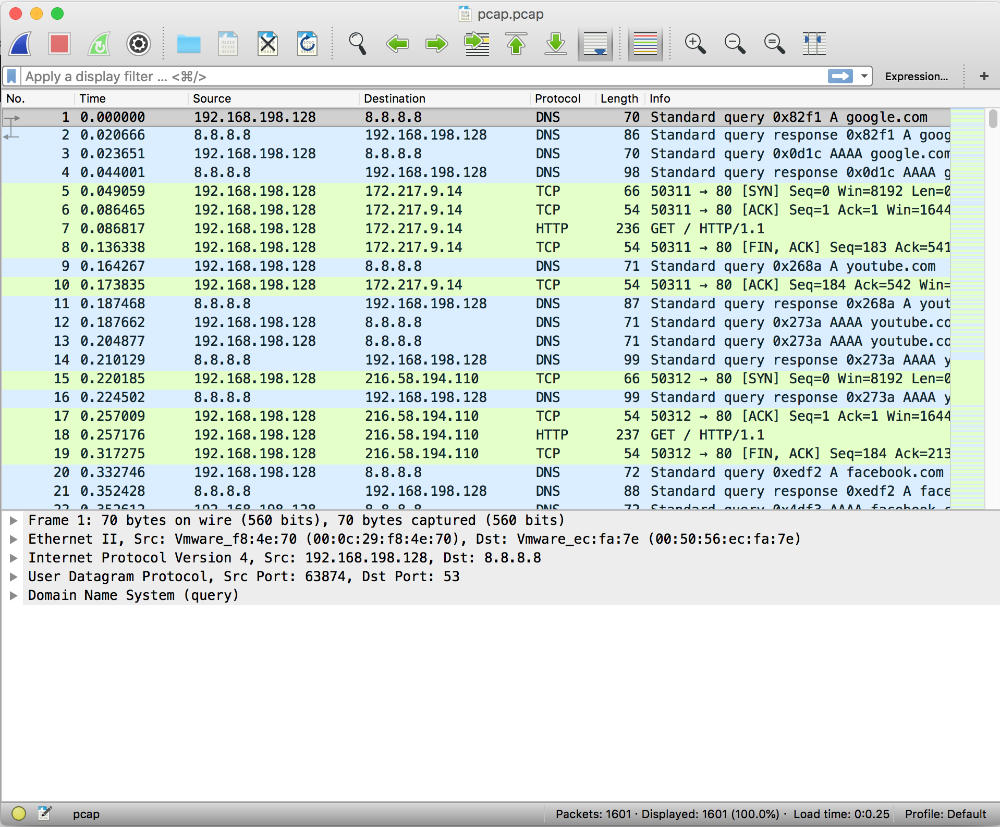

# FlowGenX: Modular Network Flow Modeling & Generation Framework

**FlowGenX** is a modular and extensible framework for network traffic analysis, modeling, and generative research. Its primary focus is **generative modeling of network flows**, while also supporting representation learning, synthetic data creation, domain reconstruction, and evaluation across multiple tasks. The framework is designed for experimentation, reproducibility, and benchmarking, with pluggable components that can be combined across different data representations and model families.



---

## Table of Contents

- [Key Features](#key-features)
- [Project Structure](#project-structure)
- [Installation](#installation)
- [Usage](#usage)
  - [Synthetic Data Generation](#synthetic-data-generation)
  - [Representations](#representations)
  - [Generative Models](#generative-models)
  - [Training Pipeline](#training-pipeline)

- [Testing](#testing)
- [Experiments](#experiments)
- [Evaluation](#evaluation)
- [Contributing](#contributing)
- [License](#license)

---

## Key Features

- **Data Handling**:
  - Load, preprocess, and batch network flows
  - Support for real-world traffic datasets and synthetic flows
  - Flexible data module design for train/validation/test splits

- **Flow Representations**:
  - Sequential tokenizers for packet and flow modeling
  - Image-like encodings for vision-based generative models
  - Pluggable representation registry
  - Save/load support for reproducibility

- **Generative Models**:
  - Diffusion models
  - GANs
  - Transformer-based sequence models
  - Unified APIs for building, training, and generation

- **Reconstruction and Validation**:
  - Domain-aware reconstruction utilities
  - Heuristic checks for traffic consistency
  - Post-generation validation before downstream evaluation

- **Evaluation and Benchmarking**:
  - Statistical metrics
  - Structural metrics
  - Downstream task evaluation
  - Extensible evaluation suite for new metrics and tasks

- **Testing & Reproducibility**:
  - Unit and integration tests for core modules
  - End-to-end validation across representations and model families
  - Synthetic flow utilities for controlled experiments

- **Utilities**:
  - Synthetic flow generation helpers
  - Logging and experiment support
  - Configuration-driven workflows

---

## 📁 Project Structure

```
data/
└── pcap/
    ├── Benign/
    │   ├── BitTorrent.pcap
    │   ├── Facetime.pcap
    │   ├── Gmail.pcap
    │   ├── MySQL.pcap
    │   ├── Outlook.pcap
    │   ├── Skype.pcap
    │   └── WorldOfWarcraft.pcap
    └── Malware/
        ├── Geodo.pcap
        ├── Miuref.pcap
        ├── Tinba.pcap
        └── Zeus.pcap


src/
├── configs/                # experiment configs (YAML)
├── core/                   # experiment & system orchestration
├── data_utils/            # PCAP loading + preprocessing pipelines
├── evaluation/            # statistical + structural + traffic metrics
│   └── tasks/             # evaluator implementations
├── experiments/           # experiment definitions / runners
├── models_ml/             # generative models
│   ├── transformer/
│   ├── gan/
│   └── diffusion/
├── reconstruction/        # decoding back to traffic (Flow level)
├── representations/       # input representations (feature spaces)
│   ├── sequential/
│   └── vision/
├── training/              # training loops / utilities
└── utils/                 # shared helpers (logging, encoders, IO)


tests/
├── integration/
└── unitary/
```

The `src/` package is organized by responsibility: representations, models, reconstruction, and evaluation form the core pipeline, while utilities, training, and experiments provide orchestration and infrastructure.

---

## Installation

1. Clone the repository:

```bash
git clone https://github.com/lucasmr19/FlowGenX.git
cd FlowGenX
```

2. Install dependencies:

```bash
pip install -r requirements.txt
```

3. Optional: install additional packages for evaluation and visualization:

```bash
pip install matplotlib scikit-image numpy pandas
```

---

## Usage

### Synthetic Data Generation

Generate synthetic flows for experimentation or testing:

```python
from src.utils.make_synthetic_flow import make_synthetic_flow, make_dataset

flows = make_dataset(num_flows=100)
print(f"Generated {len(flows)} synthetic flows")
```

---

### Representations

Multiple representations are supported:

```python
from src.representations.sequential.tokenizer import FlatTokenizer, SequentialConfig
from src.representations.vision.gaf import GAFRepresentation, GAFConfig
from src.representations.vision.nprint import NprintImageRepresentation, NprintImageConfig

# Flat tokenizer
flat = FlatTokenizer(SequentialConfig(max_length=64))
flat.fit(flows[:50])
encoded = flat.encode(flows[51])

# GAF representation
gaf = GAFRepresentation(GAFConfig(image_size=32, method="summation"))
gaf.fit(flows[:50])
img = gaf.encode(flows[51])

# Nprint image representation
nprint = NprintImageRepresentation(NprintImageConfig(max_packets=10))
nprint.fit(flows[:50])
matrix = nprint.encode(flows[51])
```

- All representations support `.encode()`
- Some support `.decode()` or reconstruction helpers depending on the representation type

---

### Generative Models

Unified API for all generative models:

```python
import torch
from src.models_ml.diffusion.ddpm import TrafficDDPM, DiffusionConfig
from src.models_ml.gan.model import TrafficGAN, GANConfig
from src.models_ml.transformer.model import TrafficTransformer, TransformerConfig

cfg = DiffusionConfig(in_channels=1, image_height=64, image_width=64, timesteps=10)
model = TrafficDDPM(cfg).build()

batch = torch.randn(8, 1, 64, 64)
loss = model.train_step(batch)
samples = model.generate(3)
```

---

### Training Pipeline

A typical mini-training loop:

```python
from src.data_utils.loaders import build_datamodule_from_dir
from src.representations.sequential.tokenizer import FlatTokenizer, SequentialConfig
from src.models_ml.diffusion.ddpm import TrafficDDPM, DiffusionConfig

rep = FlatTokenizer(SequentialConfig(max_length=64))
dm = build_datamodule_from_dir(
    "data/pcap",
    representation=rep,
    batch_size=8,
    seed=42,
)
dm.setup()

model = TrafficDDPM(DiffusionConfig(in_channels=1, image_height=64, image_width=64, timesteps=10)).build()

for batch in dm.train_dataloader():
    loss = model.train_step(batch)
    print("Loss:", loss.item())

samples = model.generate(5)
print("Generated samples:", samples.shape)
```

- Supports end-to-end generation, representation fitting, and model training
- Modular design allows swapping representations and models independently

---

## Testing

Run all tests:

```bash
python -m pytest tests -v
```

- Integration tests cover the main representation families and model families
- End-to-end tests validate the pipeline from data loading to evaluation

---

## Experiments

- Place experiment scripts in `src/experiments/`
- Use `src/configs/` to store experiment and model configurations
- Keep experiment definitions separated from model, representation, and evaluation code

---

## Evaluation

- Evaluate generative models with:
  - statistical metrics
  - structural consistency checks
  - reconstruction validation
  - downstream utility metrics
  - representation-space similarity metrics

- The `src/evaluation/` package hosts the evaluation suite and metric implementations

---

## Contributing

- Fork the repository and follow the modular structure
- Write unit and integration tests for new modules
- Keep responsibilities separated across representations, models, reconstruction, and evaluation
- Submit pull requests with clear descriptions of the changes

---

## License

[GNU AFFERO GENERAL PUBLIC LICENSE](LICENSE).
